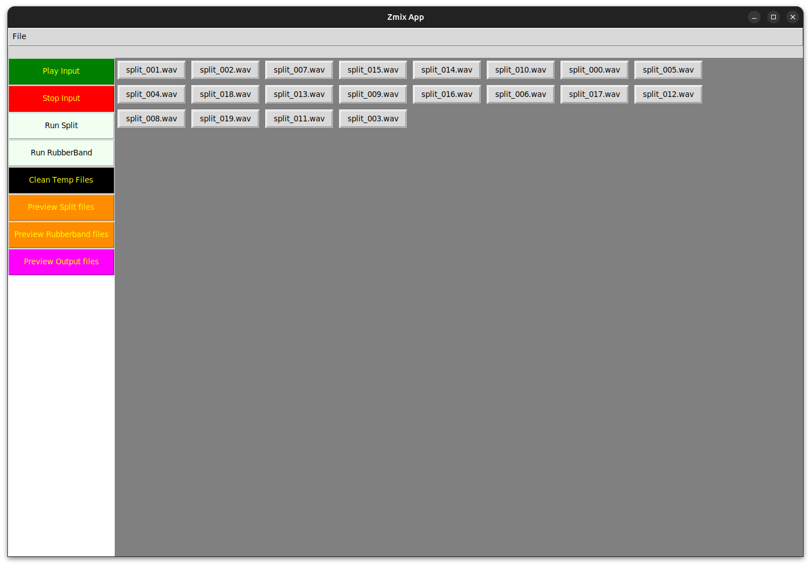

## zmix-gui-app
Shuffle sound randomiser using ffmpeg and rubberband-cli in tkinter GUI  

### Install

#### Requirements

~~~sh
sudo apt-get install python3-venv
sudo apt-get install python3-tk -y
sudo apt-get install python3-pygame -y
sudo apt-get install rubberband-cli -y
sudo apt-get install ffmpeg -y
~~~

#### How to start Zmix App

~~~sh
python3 main.py
# pygame 2.1.2 (SDL 2.26.3, Python 3.11.2)
~~~

#### How it works

- Import some mp3 file.
- Click "Run Rubberband" and wait until job is done.
- Click "Preview Rubberband files" and start playing and listen the result.

